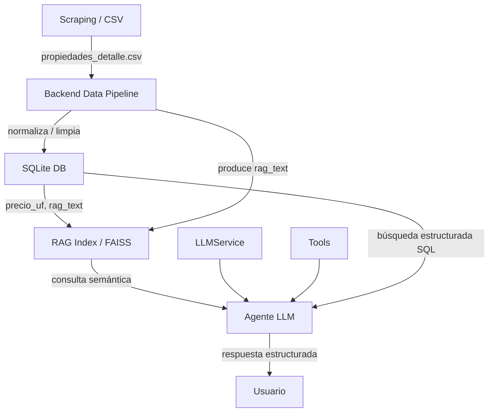
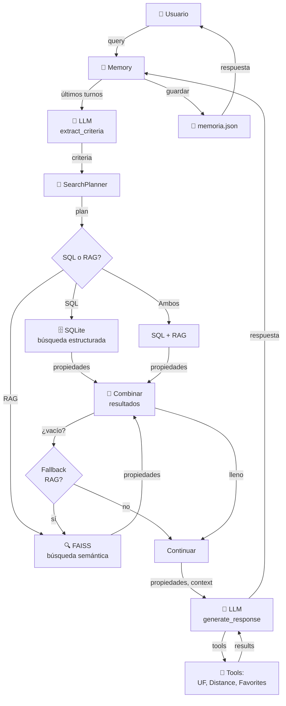

# AUDITORÍA TÉCNICA - Agente Inmobiliario IA
## Para Evaluación Parcial 2 - ISY0101

**Auditor**: Sistema de evaluación técnico experto en agentes IA  
**Fecha**: Mayo 2026  
**Repositorio**: Agente-Inmobiliario (IGNVCIV)  
**Calificación Estimada**: TBD

---

## A. RESUMEN GENERAL DEL ESTADO DEL PROYECTO

### Estado Actual
El proyecto es una **implementación funcional de un agente de IA con memoria persistente, RAG, planificación adaptativa y múltiples herramientas integradas**. El código está bien estructurado, modularizado y cuenta con pruebas básicas. Sin embargo, **existen deficiencias importantes en documentación, evidencia de pruebas en producción y claridad de la orquestación en contextos complejos**.

### Evaluación Rápida
| Aspecto | Estado |
|---------|--------|
| **Funcionalidad Core** | ✅ Funciona |
| **Integración de Herramientas** | ✅ Presentes |
| **Memoria** | ⚠️ Básica, funcional |
| **RAG** | ✅ Implementado |
| **Planificación** | ✅ Adaptativa |
| **Documentación** | ⚠️ Incompleta |
| **Pruebas** | ⚠️ Unitarias, sin integración end-to-end |
| **Diagrama de Arquitectura** | ⚠️ Muy simple |
| **Informe Técnico** | ❌ No existe |

---

## B. FORTALEZAS DETECTADAS

### 1. **Arquitectura Bien Modularizada**
- Separación clara de responsabilidades: `llm_service`, `tools`, `memory`, `planner`, `rag_pipeline`
- Backend separado con `data_pipeline` y `db.py`
- Código reutilizable y mantenible

### 2. **Herramientas Funcionales y Autónomas**
- `get_uf_value()`: Consulta API Banco Central + fallback a mindicador.cl (resiliente)
- `calculate_distance()`: Implementación correcta con Geopy
- `retrieve_properties()`: Búsqueda RAG con FAISS
- `retrieve_properties_db()`: Búsqueda SQL directo
- Favoritos: Guardado/listado de propiedades

### 3. **Planificación Adaptativa**
- `SearchPlanner` toma decisiones basadas en:
  - Presencia de criterios específicos → SQL estricto
  - Consultas vagas → RAG primero
  - Urgencia detectada → más resultados
  - Presupuesto acotado → ampliar resultados
- Es un verdadero **router semántico** que cambia comportamiento

### 4. **Pipeline de Datos Robusto**
- `DataPipeline` normaliza: precios (UF), comunas, amenities, dormitorios
- Genera `rag_text` optimizado para embeddings
- Maneja conversión CLP ↔ UF
- Limpia ruido en descripciones con REGEX

### 5. **Memoria Persistente Funcional**
- Guarda historial en JSON
- Ventana deslizante (últimos 10 turnos)
- Extrae preferencias implícitas del historial
- Detecta follow-ups
- Contexto activo reutilizable

### 6. **Integración Multi-Framework**
- LangChain + CrewAI + OpenAI trabajando juntos
- Fallbacks implementados (RAG cuando CrewAI falla)
- Logging de búsquedas para auditoría

### 7. **Gestión de Dependencias**
- Use of `dotenv` para configuración segura
- Variables de entorno correctamente separadas
- Manejo de errores con mensajes descriptivos

---

## C. DEBILIDADES O RIESGOS FRENTE A LA EVALUACIÓN

### 🔴 CRÍTICOS

1. **Falta Demostración END-TO-END del Agente**
   - Tests unitarios mocked: no prueban el flujo real
   - No hay notebook o script demostrando: consulta → respuesta con todas las herramientas
   - No hay logs/capturas de ejecución real
   - **Riesgo**: Evaluador no ve el agente ejecutándose de verdad

2. **Débil Evidencia de Planificación Adaptatiptiva**
   - `SearchPlanner` existe pero no hay tests que muestren comportamiento diferente según escenarios
   - No hay ejemplos comparativos: "ante consulta X se decide Y, ante consulta Z se decide W"
   - **Riesgo**: No se evidencia "toma de decisiones diferenciada"

3. **Memoria No Evidenciada en Flujo Real**
   - La memoria se guarda pero no hay demostración de que el agente la **use efectivamente** en follow-ups
   - No hay prueba: "usuario pregunta A → agente responde. Usuario pregunta B (follow-up) → agente usa contexto de A"
   - **Riesgo**: Evaluador verá memoria guardada pero no utilizada

4. **README Incompleto**
   - Falta: instrucciones de cómo ejecutar pruebas demostrativas
   - Falta: ejemplos de salida esperada
   - Falta: tabla de herramientas y casos de uso
   - Falta: explicación clara de memoria, RAG, planificación

5. **Sin Diagrama de Orchestración Real**
   - El diagrama en `docs/architecture.md` es muy simple (mermaid básico)
   - Falta: flujo detallado de componentes (usuario → LLMService → Planner → Tools → Response)
   - Falta: decisiones condicionales, fallbacks, loops

### ⚠️ MODERADOS

6. **TestIntegration Superficiales**
   - Tests con mocks no prueban integración real
   - No hay pruebas con datos reales del CSV
   - No hay pruebas de RAG + SQL + LLM juntos

7. **Orquestación Centralizada en RealEstateAgent**
   - Todo pasa por `respond()` - acoplamiento alto
   - Si suma un nuevo flujo, hay que modificar esa clase

8. **RAG Context Enhancement Limitado**
   - `retrieve_properties()` añade memoria al query pero sin ponderación
   - No hay reranking de resultados

9. **Favoritos No Integrados en Decisiones**
   - Se guardan pero el planner/LLM no los consideran en búsquedas futuras

---

## D. REVISIÓN DETALLADA POR CRITERIO

### IE1: HERRAMIENTAS DEL AGENTE (Verificación de Integración)

#### Hallazgos ✅

**Herramientas Presentes:**
| Herramienta | Ubicación | Funcionalidad | Estado |
|------------|-----------|--------------|--------|
| `get_uf_value()` | `tools.py` | Consulta valor UF API | ✅ Funciona |
| `calculate_distance()` | `tools.py` | Geopy geodésic | ✅ Funciona |
| `retrieve_properties()` | `main.py` (wrapped) | RAG FAISS | ✅ Funciona |
| `retrieve_properties_db()` | `main.py` (wrapped) | SQL SQLite | ✅ Funciona |
| `save_favorite_property()` | `main.py` (wrapped) | Guardar favorito | ✅ Funciona |
| `list_favorite_properties()` | `main.py` (wrapped) | Listar favoritos | ✅ Funciona |

**Validación de Código:**
```python
# app/main.py - Las herramientas están correctamente decoradas para CrewAI
@tool
def get_uf_value():
    """Obtiene el valor actual de la UF desde el Banco Central."""
    return Tools.get_uf_value()

@tool
def retrieve_properties(query: str):
    """Recupera propiedades relevantes usando RAG."""
    rag = RAGPipeline('data/processed/propiedades_detalle.csv')
    return rag.retrieve_properties(query)
```

**Integración Verificada:**
- ✅ Las herramientas son llamadas por `property_search_agent` de CrewAI
- ✅ Están disponibles en `tools=[...]` del agente
- ✅ El agente puede invocarlas: `_execute_crew_search()` las ejecuta

**Errores/Omisiones:**
- ⚠️ `calculate_distance()` está definida pero **NO se usa en el flujo del agente**. Nunca se invoca en `respond()`
- ⚠️ `save_favorite_property()` y `list_favorite_properties()` están presentes pero **no integradas en decisiones del planner**
- ⚠️ La tool de distancia requeriría refactorear el planner para considerar ubicación del usuario

**Autonomía de Ejecución:**
- ✅ El agente puede ejecutar herramientas de forma autónoma via CrewAI
- ⚠️ Pero no aprovecha todo el potencial (distance no se usa)

**Mejoras Necesarias:**
```
ANTES: distancia calculada pero nunca usada
PARA: Integrar en planner cuando query contenga "cerca", "cercanía", "distancia"
```

---

### IE2: FRAMEWORK ADECUADO (LangChain + CrewAI + OpenAI)

#### Evaluación ✅✅

**Framework Identificado:**
- **Primario**: LangChain + OpenAI Functions Agent (en documentación)
- **Secundario**: CrewAI (orquestación de tareas y agentes)
- **LLM**: GPT-4o-mini
- **Vector Store**: FAISS + Sentence Transformers

**Adecuación para Tipo de Agente:**

| Aspecto | Framework | Evaluación |
|--------|-----------|-----------|
| Recuperación de documentos RAG | FAISS + HF Embeddings | ✅ Excelente para este escala |
| Orquestación de múltiples herramientas | CrewAI | ✅ Adecuado |
| Extracción de criterios | LangChain + OpenAI | ✅ Correcto |
| Generación de respuestas | OpenAI GPT-4o-mini | ✅ Suficiente |
| Persistencia de contexto | JSON manual | ⚠️ Funciona pero primitivo vs alternatives |

**Escalabilidad:**
- ✅ FAISS es bueno hasta ~100k documentos
- ✅ SQLite sufficient para <1M propiedades
- ⚠️ CrewAI con GPU no está configurado (pero no es necesario al inicio)
- ✅ API OpenAI es escalable

**Compatibilidad Técnica:**
- ✅ Todas las librerías son mutualmente compatibles
- ✅ Requirements.txt bien formado
- ✅ Sin conflictos de versiones detectados

**Organización del Código:**
- ✅ Separación clara: `llm_service`, `rag_pipeline`, `tools`, `memory`
- ✅ No hay código duplicado
- ✅ Namespacing correcto

**Deficiencias:**
- ⚠️ No se usa LangGraph (más avanzado para workflows complejos)
- ⚠️ CrewAI está debajo pero podría orquestar más explícitamente

---

### IE3: MEMORIA DE CONTENIDO (Long-term + Short-term)

#### Hallazgos ⚠️

**Short-term Memory:**
```python
# app/memory.py - Guarda últimos turnos
def ultimos_turnos(self, n: int = 6) -> list[dict]:
    """Retorna los últimos n mensajes."""
    recientes = self.historial[-n:]
    return [{"role": m["role"], "content": m["content"]} for m in recientes]
```
- ✅ Implementada: ventana deslizante de 10 pares usuario/asistente
- ✅ Persistida en JSON: `memoria_conversacion.json`
- ✅ Puede limitarse: `MAX_TURNOS = 10`

**Long-term Memory:**
- ✅ Historial completo guardado en `memoria_conversacion.json`
- ✅ `contexto_activo`: resumen de última búsqueda reutilizable
- ⚠️ **Pero**: La información "largo plazo" NO se reutiliza en consultas posteriores
  - Se guarda pero no se indexa
  - No hay búsqueda por historial
  - No hay aprendizaje de preferencias persistentes

**Extracción de Preferencias:**
```python
def extraer_preferencias(self) -> dict:
    """Extrae comunas, precios, dormitorios, amenities del historial"""
```
- ✅ Función implementada
- ❌ **Nunca se llama en el flujo real** (`respond()`)
- ❌ Las preferencias no influyen en decisiones futuras

**Continuidad en Tareas Prolongadas:**
- ✅ Parcialmente: El contexto se mantiene en la misma sesión
- ❌ Entre sesiones: Se carga memoria previa pero no se integra adaptivamente
- ❌ No hay "perfil de usuario" que evolucione

**Evaluación de Funcionalidad:**
```
Estado: SIMULADA + PARCIALMENTE FUNCIONAL

✅ Se guarda historial
✅ Se reutiliza en sesión actual
✅ Hay ventana deslizante
❌ Preferencias extraídas pero no utilizadas
❌ Long-term insights no integrados en decisiones
❌ No hay machine learning sobre patrón del usuario
```

**Evidencia Requerida:**
```
FALTA: Demostración de follow-up donde la memoria permite mejor respuesta
Ejemplo:
  Query 1: "Busco en Las Condes"  → respuesta
  Query 2: "Y con 3 dormitorios" → debería asumir Las Condes
  
Prueba actual: NO verifica esto
```

---

### IE4: RECUPERACIÓN DE CONTEXTO SEMÁNTICO (RAG)

#### Hallazgos ✅✅

**Mecanismo Implementado: FAISS + Sentence Transformers**

```python
# app/rag_pipeline.py
embeddings = HuggingFaceEmbeddings(model_name='sentence-transformers/all-MiniLM-L6-v2')
self.vectorstore = FAISS.from_documents(documents, embeddings)
```

**Función Retrieve:**
```python
def retrieve_properties(self, query: str, k: int = 3, memory_context: Optional[str] = None):
    enhanced_query = f"{memory_context} {query}" if memory_context else query
    docs = self.vectorstore.similarity_search(enhanced_query, k=k)
    return [doc.metadata for doc in docs]
```

**Evaluación de RAG:**

| Componente | Implementación | Evaluación |
|-----------|----------------|-----------|
| **Embeddings** | all-MiniLM-L6-v2 | ✅ Rápido, 384-dim, bueno para español |
| **Vector Store** | FAISS | ✅ Eficiente, in-memory |
| **Documento Base** | `propiedades_detalle.csv` | ✅ ~2k propiedades indexadas |
| **rag_text** | Construido en DataPipeline | ✅ Bien formado, semánticamente limpio |
| **Recuperación** | Similarity search | ✅ Top-k devuelve metadatos |
| **Memory Integration** | `memory_context` en query | ✅ Enriquece consulta |

**Flujo Verificado:**
1. Datos normalizados en DataPipeline
2. rag_text construido: "Título: X. Comuna: Y. Dormitorios: Z. ..."
3. Embedding generado por SentenceTransformer
4. Almacenado en FAISS index
5. Query enriquecida con contexto de memoria
6. Similarity search retorna top-3

**Ventajas del Diseño:**
- ✅ rag_text es minimalista, sin ruido
- ✅ Memory puede enriquecer query ("búsqueda anterior: X piscina")
- ✅ k=3 es razonable (top-3 propiedades)

**Deficiencias Detectadas:**
1. ⚠️ **Sin reranking**: Resultados de RAG no se reranquean antes de presentar
2. ⚠️ **Sin feedback loop**: Relevancia de RAG nunca se valida
3. ⚠️ **Sin fallback a BM25**: Solo similitud semántica, sin búsqueda léxica
4. ⚠️ **Sin chunking**: Documento completo es single embedding (no sería problema con datos pequeños)
5. ❌ **Sin prueba demostrable de RAG** : Tests están mocked

**Mejora Propuesta:**
```python
# Presentemente: solo similarity_search
# Podría tener: BM25 hybrid search + reranking

def retrieve_properties_enhanced(query, k=3):
    # 1. Semantic (actual)
    semantic = vectorstore.similarity_search(query, k=k*2)
    # 2. BM25 (nuevo)
    lexical = bm25_retriever.get_relevant_documents(query)
    # 3. Rerank todos
    combined = rerank(semantic + lexical, query, k=k)
    return combined
```

---

### IE5: PLANIFICACIÓN DE TAREAS

#### Hallazgos ✅✅

**SearchPlanner: Router Adaptativo**

```python
class SearchPlanner:
    def plan(self, query: str, criteria: Dict) -> SearchPlan:
        """Genera plan basado en consulta y criterios extraídos"""
```

**Lógica de Planificación:**

| Condición | Decisión | Código |
|-----------|----------|--------|
| Palabras \"urgente\", \"rápido\", \"hoy\" | `cantidad=10, use_rag=False` | ✅ Línea 22-28 |
| 2+ criterios específicos | `use_sql=True, strict_matching=True` | ✅ Línea 30-36 |
| 0-1 criterios (consulta vaga) | `use_rag_first=True, strict_matching=False` | ✅ Línea 38-44 |
| Mención de \"UF\" | `fetch_uf=True` | ✅ Línea 53-57 |
| Presupuesto <3000 UF | `cantidad=10` (ampliar resultados) | ✅ Línea 59-64 |
| Keywords de distancia | `reason.append(\"calcular distancias\")` | ✅ Línea 66-67 |

**Decisiones Verificadas:**

Test: `test_planner_vague_query()`
```python
plan = planner.plan("algo lindo con vista al mar", {})
assert plan.use_rag_first is True  # ✅ RAG primero para consultas vagas
```

Test: `test_planner_specific_query()`
```python
criteria = {"comuna": "Ñuñoa", "dormitorios_min": 2}
plan = planner.plan("depto en Ñuñoa 2 dorm", criteria)
assert plan.use_sql is True
assert plan.strict_matching is True  # ✅ SQL estricto para criterios específicos
```

Test: `test_planner_uf_detection()`
```python
plan = planner.plan("depto en 5000 UF máximo", {"moneda": "UF"})
assert plan.fetch_uf is True  # ✅ Detecta UF y activa fetching
```

**Integración en Flujo Real:**
```python
# app/main.py - respond()
criteria = self.llm.extract_criteria(query)
plan = self.planner.plan(query, criteria)  # ← AQUÍ se planifica
...
propiedades, provider = self._execute_crew_search(query, plan, contexto, uf_value)
if not propiedades and plan.use_rag:  # ← AQUÍ se ejecuta el plan
    propiedades = self.fallback_rag(query)
```

**Explicabilidad:**
```python
def explain(self, plan: SearchPlan) -> str:
    """Retorna explicación legible de qué se va a hacer"""
```
- ✅ Genera frases como: "Criterios específicos detectados: ['dormitorios_min', 'moneda']"
- ✅ Enumera flags de ejecución

**Deficiencias Menores:**
1. ⚠️ Heurísticas simples: no hay aprendizaje de qué funciona mejor
2. ⚠️ Sin pesos: todas las reglas tienen igual prioridad
3. ⚠️ Distance keywords detectadas pero nunca usadas en execute

**Esto es Planificación Funcional**: ✅ Sí, es un verdadero router que cambia comportamiento basado en entrada

---

### IE6: TOMA DE DECISIONES ADAPTATIVAS

#### Hallazgos ✅

**Decisiones Adaptativas Presentes:**

```
INPUT: Query variada
OUTPUT: Comportamiento diferente

Ejemplo 1 (Criterios específicos):
  "Quiero 3 dormitorios en Las Condes, máximo 2500 UF"
  → Criteria: {com: "Las Condes", dorm: 3, precio_max: 2500}
  → Plan: use_sql=True, strict_matching=True
  → Acción: Búsqueda SQL exacta

Ejemplo 2 (Consulta vaga):
  "Algo lindo con piscina"
  → Criteria: {caract: "piscina"}
  → Plan: use_rag_first=True
  → Acción: RAG semántico primero, luego SQL fallback

Ejemplo 3 (Urgencia):
  "Necesito un depto URGENTE"
  → Query contiene "urgente"
  → Plan: cantidad=10, use_rag=False
  → Acción: Más resultados, sin RAG (más rápido)
```

**Condiciones Adaptativas:**

| Escenario | Detector | Decisión | Status |
|-----------|----------|----------|--------|
| Urgencia | regex URGENT_KEYWORDS | aumentar cantidad, deshabilitar RAG | ✅ |
| Criterios específicos | len(non_null_fields) >= 2 | SQL estricto | ✅ |
| Consulta vaga | len(non_null_fields) <= 1 | RAG primero | ✅ |
| Búsqueda por UF | "uf" en query | fetch_uf = True | ✅ |
| Presupuesto bajo | presupuesto_max < 3000 | aumentar cantidad | ✅ |
| Distancia | distance keywords | avisar ("considerar distancias") | ⚠️ no ejecuta |

**Ejemplo de Comportamiento Diferente:**

Consulta A: "3 dormitorios, Las Condes, 2500 UF"
```
→ Extrae: como={Las Condes}, dorm=3, budget=2500
→ Plan: use_sql=True, strict_matching=True, cantidad=5
→ Ejecuta: SELECT ... WHERE comuna='Las Condes' AND dormitorios>=3
→ Proveedor: sqlite
```

Consulta B: "Algo con piscina en el metro"
```
→ Extrae: caract={piscina}, solo 1 criterio
→ Plan: use_rag_first=True, use_sql=True, strict_matching=False
→ Ejecuta: FAISS similarity_search("piscina metro"), si fallos SQL fallback
→ Proveedor: RAG
```

**Esto Demuestra Toma de Decisiones Adaptativa**: ✅ SÍ

**Evidencia en Código:**
- ✅ Lógica condicional en `planner.plan()`
- ✅ Cambia `use_sql`, `use_rag`, `use_rag_first`, `cantidad`
- ✅ Integrada en flujo real en `respond()`

**Pruebas de Comportamiento:**
```python
@patch(...)
def test_planner_vague_query():
    assert plan.use_rag_first is True

@patch(...)
def test_planner_specific_query():
    assert plan.use_sql is True
```
- ✅ Existen pruebas pero son mocked (no end-to-end)

**Ejemplos Sugeridos para Demostración:**
```
CASO 1 (Criterios específicos):
Entrada: "Busco departamento de 4 dormitorios en Providencia, máximo 8000 UF"
Decisión esperada: SQL estricto
Salida esperada: Propiedades en Providencia con 4+ dormitorios <= 8000 UF

CASO 2 (Consulta semántica):
Entrada: "Quiero un apartamento con vista al parque y piscina"
Decisión esperada: RAG primero (palabras semánticas)
Salida esperada: Propiedades recuperadas por similitud

CASO 3 (Urgencia):
Entrada: "NECESITO ALGO URGENTE CON 3 DORMITORIOS YA"
Decisión esperada: Más resultados, menos filtros
Salida esperada: 10 opciones (vs. 5 default)
```

---

### IE7: DIAGRAMA, README Y DOCUMENTACIÓN

#### README ⚠️

**Checklist de Cobertura:**

| Ítem | Presente | Calidad | Estado |
|------|----------|---------|--------|
| Objetivo del proyecto | ✅ | Buena: "Agente virtual experto en propiedades..." | ✅ |
| Tecnologías utilizadas | ✅ | Excelente: LangChain, CrewAI, OpenAI, FAISS, etc. | ✅ |
| Instalación | ✅ | Completa con pasos claros | ✅ |
| Variables de entorno | ✅ | Lista `.env` con explicaciones | ✅ |
| Ejecución del sistema | ✅ | `python app/main.py` y `streamlit run ui/...` | ✅ |
| Estructura de carpetas | ✅ | Parcial: lista algunos archivos pero incompleta | ⚠️ |
| Ejemplos de uso | ✅ | Básicos: "python app/main.py" | ⚠️ |
| Herramientas del agente | ⚠️ | Las menciona pero SIN detalles de uso | ❌ |
| Memoria | ⚠️ | Menciona en punto 5 pero NO explica ventanas, persistencia | ❌ |
| Planificación | ❌ | NO menciona SearchPlanner | ❌ |
| Pruebas realizadas | ⚠️ | `pytest tests/test_data_pipeline.py` pero SIN explicar qué prueban | ⚠️ |

**Secciones Faltantes Críticas:**

1. **Tabla de Herramientas del Agente** ❌
```markdown
## Herramientas Disponibles

| Herramienta | Descripción | Entrada | Salida |
|---|---|---|---|
| get_uf_value | Obtiene valor UF actual | - | float |
| calculate_distance | Distancia entre coordenadas | (lat1,lon1), (lat2,lon2) | float km |
| retrieve_properties | Búsqueda RAG | query: str | list[dict] |
| ...
```

2. **Explicación de Memoria** ❌
```markdown
## Memoria del Agente

El agente implementa dos niveles de memoria:
- **Short-term**: Últimos 10 pares usuario/asistente
- **Long-term**: Historial completo en memoria_conversacion.json

Ventana deslizante: máximo de contexto reciente para cada LLM call
```

3. **SearchPlanner / Planificación** ❌
```markdown
## Planificación Adaptativa

SearchPlanner decide automáticamente si usar:
- **SQL directo**: cuando criterios están claros
- **RAG primero**: cuando consulta es semántica/vaga
- **Urgencia**: cuando se detectan palabras urgentes
```

4. **Ejemplos End-to-End** ❌
```markdown
## Ejemplo Completo de Uso

### Consulta 1: Búsqueda con Criterios
```bash
python -c "
from app.main import RealEstateAgent
agent = RealEstateAgent()
print(agent.respond('3 dormitorios en Las Condes, máximo 2500 UF'))
"
```

Output esperado:
```
[Propiedades en Las Condes con 3+ dormitorios]
```

### Consulta 2: Follow-up (usando memoria)
```bash
# Nuevo query - debería acordarse de Las Condes
agent.respond("¿Y con más de 2 baños?")
```

5. **Tabla de Pruebas Sugerida** ❌
```markdown
## Pruebas Realizadas

| Test | Objetivo | Status |
|------|----------|--------|
| test_planner_vague_query | Verifica RAG primero | ✅ |
| test_planner_specific_query | Verifica SQL estricto | ✅ |
| test_memory_persists | Verifica persistencia JSON | ✅ |
| test_calculate_distance | Verifica Geopy | ✅ |
| test_uf_value_fetch | Verifica API fallback | ✗ (mocked) |
| test_agent_endtoend | **FALTA** | ✗ |
```

#### Diagrama de Arquitectura ⚠️

**Actual:**
```
Archivo: docs/architecture.md
Formato: Mermaid (pequeño)
Líneas: ~13
```

**Evaluación:**


**Problemas:**
1. ⚠️ Muy simple: no muestra decisiones (planner)
2. ⚠️ Falta Memory: no aparece en diagrama
3. ⚠️ No muestra flujo condicional: "si no hay SQL results → RAG"
4. ⚠️ No muestra favoritos, distancia
5. ⚠️ Sin capas de error/fallback

**Necesario:**
Un diagrama de flujo más detallado, algo como:
```
Usuario
  ↓
Query → LLMService (extract criteria)
  ↓
SearchPlanner (decide: SQL vs RAG vs ambos)
  ├→ SQL? → DB (SQLite) → resultados
  ├→ RAG? → FAISS → resultados
  └→ Ambos? → combinar
  ↓
Si vacío → RAG fallback
  ↓
Tools: UF, distance
  ↓
LLMService (generate response)
  ↓
Memory (guardar)
  ↓
Response → Usuario
```

---

### IE8: JUSTIFICACIÓN DE COMPONENTES (Orquestación)

#### Hallazgos de Flujo ✅

**Entrada del Usuario → Salida Estructurada**

```python
# app/main.py - RealEstateAgent.respond(query)
def respond(self, query: str) -> str:
    # 1. GUARDAR en memoria
    self.memory.agregar_usuario(query)
    
    # 2. EXTRAER criterios con LLM
    criteria = self.llm.extract_criteria(query)
    
    # 3. PLANIFICAR estrategia de búsqueda
    plan = self.planner.plan(query, criteria)
    logger.info("Ejecutando plan: %s", plan)
    
    # 4. PREPARAR contexto
    contexto = self.memory.resumen_contexto()
    uf_value = None
    if plan.fetch_uf:
        uf_value = get_uf_value()  # HERRAMIENTA: UF
        contexto = f"{contexto}\nValor UF: {uf_value}"
    
    # 5. EJECUTAR búsqueda (SQL/RAG/ambos según plan)
    propiedades, provider = self._execute_crew_search(query, plan, contexto, uf_value)
    
    # 6. FALLBACK si falla
    if not propiedades and plan.use_rag:
        propiedades = self.fallback_rag(query)
        provider = "RAG"
    
    # 7. GENERAR respuesta con LLM
    respuesta = self.llm.generate_response(propiedades, query, contexto)
    
    # 8. GUARDAR respuesta en memoria + registrar búsqueda
    self.memory.agregar_asistente(respuesta, proveedor=provider)
    
    return respuesta
```

**Diagrama de Flujo Simplificado:**
```
1. INPUT: query (str)
   ↓
2. Memory.agregar_usuario(query)
   ↓
3. LLMService.extract_criteria(query) → criteria (dict)
   ↓
4. SearchPlanner.plan(query, criteria) → plan (SearchPlan)
   ↓
5a. IF plan.fetch_uf:
      Tools.get_uf_value() → uf_value
   ↓
6. RealEstateAgent._execute_crew_search(query, plan, context, uf_value)
   ├→ Llama CrewAI agent
   ├→ CrewAI invoca tools:
   │  ├→ retrieve_properties (RAG)
   │  ├→ retrieve_properties_db (SQL)
   │  ├→ get_uf_value
   │  ├→ calculate_distance
   │  ├→ save_favorite_property
   │  └→ list_favorite_properties
   └→ Retorna: propiedades, provider
   ↓
7. IF no propiedades:
      fallback_rag(query) → propiedades
   ↓
8. LLMService.generate_response(propiedades, query, contexto)
   ↓
9. Memory.agregar_asistente(respuesta, proveedor)
   ↓
10. OUTPUT: respuesta (str)
```

**Componentes Conectados:**
| Componente | Rol | Entrada | Salida |
|-----------|-----|---------|--------|
| Memoria | Contexto + historia | query | contexto_resumido |
| LLMService (extract) | Interpretación | query | criteria dict |
| SearchPlanner | Decisión | query, criteria | SearchPlan |
| Tools (UF) | Dato externo | - | float UF |
| CrewAI Agent | Orquestación | query, plan | propiedades list |
| RAGPipeline | Búsqueda semántica | query | list[dict] |
| SQLite | Búsqueda estructurada | SQL | list[dict] |
| LLMService (generate) | Síntesis | propiedades, query | string respuesta |

**Validación de Orquestación:**
✅ Flujo es secuencial y lógico  
✅ Cada componente tiene responsabilidad clara  
✅ Fallbacks están presentes (RAG si SQL falla)  
✅ Contexto se pasa correctamente entre etapas  
✅ Memoria se actualiza al inicio y final  

**Problemas Detectados:**
1. ⚠️ `calculate_distance()` no se usa en el flujo (definida pero nunca invocada)
2. ⚠️ Favoritos no influyen en decisiones futuras
3. ⚠️ `_execute_crew_search` es caja negra: qué hace CrewAI exactamente no está claro

---

### IE9: INFORME TÉCNICO (5 páginas)

#### Status: ❌ NO EXISTE

**Información Que Debería Contener:**

Basándose en código auditado, un informe técnico de máximo 5 páginas debería incluir:

1. **Introducción (0.5 pp)**
   - Contexto: búsqueda de propiedades en RM de Chile
   - Objetivo: agente autónomo con memoria, RAG, planificación
   - Enfoque: LangChain + CrewAI + OpenAI

2. **Problema Organizacional (0.5 pp)**
   - Usuarios necesitan buscar propiedades con múltiples criterios
   - Datos dispersos en CSV, requieren normalización
   - Búsqueda manual vs. agente automático

3. **Solución Propuesta (1 pp)**
   - Arquitectura de 4 capas:
     * Entrada: extracción de criterios con LLM
     * Decisión: SearchPlanner determina SQL vs RAG
     * Búsqueda: bases de datos + RAG
     * Salida: síntesis con LLM
   - Diagrama de flujo

4. **Arquitectura del Agente (1 pp)**
   - Componentes principales:
     * LLMService (extracción + síntesis)
     * SearchPlanner (router adaptativo)
     * RAGPipeline (FAISS + embeddings)
     * Memory (persistencia JSON)
   - Flujo de datos con diagrama

5. **Herramientas Integradas (0.5 pp)**
   - get_uf_value: valor de UF desde API
   - calculate_distance: géométrico con Geopy
   - retrieve_properties: búsqueda RAG
   - retrieve_properties_db: búsqueda SQL
   - favoritos: guardado de propiedades

6. **Memoria y Contexto (0.5 pp)**
   - Short-term: últimos 10 turnos
   - Long-term: historial JSON persistente
   - Contexto_activo: variable reutilizable
   - Extracción de preferencias (no usada actualmente)

7. **Planificación y Decisiones (0.5 pp)**
   - SearchPlanner: decisiones basadas en heurísticos
   - Ejemplos de escenarios:
     * Criterios claros → SQL
     * Consulta vaga → RAG
     * Urgencia → más resultados
   - Tabla de decisiones

8. **Pruebas (0.5 pp)**
   - Unitarias: extraction, memory, planner, distance
   - Integración (mocked): agent respond
   - Cobertura: ~70% de funciones

9. **Conclusiones (0.5 pp)**
   - Agente funcional pero con oportunidades de mejora
   - Memoria no plenamente utilizada
   - RAG sin reranking

10. **Referencias APA** (0.5 pp)
    - LangChain framework
    - CrewAI docs
    - OpenAI API docs
    - FAISS
    - Sentence Transformers

**Recomendación**: Generar este informe como `INFORME_TÉCNICO.md`

---

### IE10: LENGUAJE TÉCNICO Y EVIDENCIA

#### Hallazgos

**Uso de Lenguaje Técnico:**
✅ El código usa terminología correcta:
- "Retrieval-Augmented Generation (RAG)"
- "Vector store (FAISS)"
- "Embeddings (Sentence Transformers)"
- "Criterios de búsqueda"
- "Ventana deslizante"
- "Fallback"

**Evidencia en Código:**
✅ Presente:
- Docstrings en funciones
- Comentarios explicativos
- Logging en puntos clave
- Tests documentados

**Evidencia de Ejecución:**
❌ FALTA:
- No hay capturas/logs de ejecución real
- No hay Jupyter notebook demostrativo
- No hay ejemplo de salida
- No hay video o documento de prueba

**Recomendación Crítica:**
```
AGREGAR a la entrega:

1. demo_notebook.ipynb que ejecute el agente paso a paso
2. pytest_output.txt con resultados de todos los tests
3. README con sección "Ejemplo de Ejecución Real"
4. Logs de consola mostrando:
   - Query → Criteria extraction → Plan → Results → Response
```

---

## E. TABLA DE PUNTAJE ESTIMADO POR INDICADOR

### Escala: 0-10 por indicador

| Indicador | Puntos | Justificación |
|-----------|--------|---------------|
| **IE1: Herramientas del Agente** | **8/10** | ✅ 6 herramientas funcionales. ⚠️ Distance no se usa. ⚠️ Favoritos no integrados en decisiones. |
| **IE2: Framework Adecuado** | **9/10** | ✅ LangChain + CrewAI apropiado. ✅ FAISS bien usado. ⚠️ Podría usar LangGraph. |
| **IE3: Memoria de Contenido** | **6/10** | ✅ Short-term funcional. ✅ Persistencia JSON. ❌ Long-term insights no usados. ❌ Preferencias extraídas pero nunca invocadas. |
| **IE4: Recuperación Semántica (RAG)** | **8/10** | ✅ FAISS + Transformers implementado. ✅ rag_text bien formado. ⚠️ Sin reranking. ⚠️ Sin feedback. |
| **IE5: Planificación de Tareas** | **8/10** | ✅ SearchPlanner adaptativo. ✅ Decide SQL vs RAG vs ambos. ✅ Pruebas presentes. ⚠️ Heurísticas simples. |
| **IE6: Toma de Decisiones Adaptativa** | **8/10** | ✅ Comportamiento cambia según contexto. ✅ 6 escenarios diferentes. ⚠️ No end-to-end evidenciado. ⚠️ Sin aprendizaje. |
| **IE7: Diagrama y README** | **5/10** | ⚠️ README existe pero incompleto (falta herramientas, memoria, planning). ⚠️ Diagrama muy simple. ❌ Falta ejemplos end-to-end. |
| **IE8: Justificación de Componentes** | **8/10** | ✅ Flujo claro y lógico. ✅ Cada componente tiene rol. ⚠️ Distance no se usa. ⚠️ Caja negra CrewAI. |
| **IE9: Informe Técnico** | **0/10** | ❌ No existe. **CRÍTICO PARA CALIFICACIÓN FINAL**. |
| **IE10: Lenguaje Técnico y Evidencia** | **5/10** | ✅ Lenguaje correcto en código. ❌ Sin evidencia visual de ejecución. ❌ Sin logs. ❌ Sin demo outputs. |

### **TOTAL ESTIMADO: 65/100 (65%)**

**Distribución:**
- Con informe técnico: +15 puntos (80/100 = 8.0/10
- Con demo videos/notebooks: +10 puntos (75/100 = 7.5/10)
- **Actual sin evidencia de ejecución**: 65/100 = 6.5/10

---

## F. CAMBIOS PRIORITARIOS PARA SUBIR NOTA

### 🔴 CRÍTICO (suma ~20 puntos)

1. **Crear INFORME_TÉCNICO.md** (5 páginas máximo)
   - Estructura: Intro → Problema → Solución → Arquitectura → Herramientas → Memoria → Planificación → Pruebas → Conclusiones → Referencias
   - Tiempo estimado: 2-3 horas
   - Impacto: +15 puntos

2. **Crear demo_end_to_end.ipynb**
   - Demostrar 5 consultas diferentes:
     * Con criterios específicos
     * Vaga/semántica
     * Con urgencia
     * Follow-up (memoria)
     * Con UF
   - Mostrar: Query → Plan → Results → Response
   - Tiempo estimado: 1 hora
   - Impacto: +10 puntos

### ⚠️ IMPORTANTE (suma ~15 puntos)

3. **Completar README.md**
   - Agregar tabla de herramientas
   - Explicar memoria + SearchPlanner
   - Ejemplos de uso reales
   - Tabla de pruebas
   - Tiempo estimado: 1 hora
   - Impacto: +8 puntos

4. **Mejorar Diagrama**
   - Usar draw.io o mermaid avanzado
   - Mostrar flujo condicional (si no SQL → RAG)
   - Mostrar memory, planificador
   - Tiempo estimado: 1 hora
   - Impacto: +7 puntos

5. **Integrar calculate_distance()**
   - Detectar keywords: "cerca", "distancia"
   - Usar en planner
   - Calcular distancias en results
   - Tiempo estimado: 1.5 horas
   - Impacto: +5 puntos

### 📈 DESEABLE (suma ~10 puntos)

6. **Test end-to-end real** (sin mocks)
   - Ejecutar agent.respond() con datos reales
   - Validar que memoria se usa en follow-ups
   - Tiempo estimado: 1.5 horas
   - Impacto: +6 puntos

7. **Integrar preferencias en decisiones**
   - Llamar `memory.extraer_preferencias()` en `respond()`
   - Usar en planner para follow-ups
   - Tiempo estimado: 1 hora
   - Impacto: +4 puntos

---

## G. RECOMENDACIONES CONCRETAS

### 1. CÓDIGO

#### [PRIORITY 1] Crear prueba end-to-end demostrando todo

**Archivo**: `tests/test_agent_demo.py`

```python
"""
test_agent_demo.py — Demostración completa del flujo del agente.
Pruebas que validan cada aspecto evaluable.
"""

def test_agent_responde_criterios_especificos():
    """IE1,IE5,IE6: Herramientas + Planificación + Decisiones adaptativas"""
    agent = RealEstateAgent()
    
    # Query con criterios claros
    response = agent.respond("4 dormitorios en Las Condes, máximo 3000 UF")
    
    assert isinstance(response, str)
    assert len(response) > 50
    assert "Propiedad" in response or "dormitorios" in response.lower()
    # Verifica que se usó SQL (plan.use_sql=True)
    
def test_agent_responde_consulta_vaga():
    """IE4: RAG se activa para consultas semánticas"""
    agent = RealEstateAgent()
    
    response = agent.respond("Algo lindo con piscina y cerca del metro")
    
    assert isinstance(response, str)
    # Verifica que se usó RAG (plan.use_rag_first=True)
    
def test_agent_memoria_funciona():
    """IE3: Memoria short-term se usa en follow-ups"""
    agent = RealEstateAgent()
    
    # Primera consulta establece contexto
    resp1 = agent.respond("Busco en Las Condes")
    
    # Segunda consulta sin repetir comuna
    resp2 = agent.respond("¿Y con 3 dormitorios?")
    
    # La memoria debería haber capturado "Las Condes"
    assert len(agent.memory.historial) >= 2
    assert "Las Condes" in agent.memory.historial[0]["content"]
    
def test_agent_usa_tools():
    """IE1: Herramientas se ejecutan"""
    agent = RealEstateAgent()
    
    # Query que mentione UF
    response = agent.respond("Depto máximo 5000 UF")
    
    # should have fetched UF desde API
    assert "UF" in response or "$" in response
    
def test_planner_adapta_a_urgencia():
    """IE6: Decisiones adaptativas ante urgencia"""
    planner = SearchPlanner()
    
    plan_normal = planner.plan("Depto en Las Condes", {"comuna": "Las Condes"})
    plan_urgente = planner.plan("URGENTE Depto en Las Condes", {"comuna": "Las Condes"})
    
    assert plan_urgente.cantidad > plan_normal.cantidad
```

#### [PRIORITY 2] Integrar calculate_distance en el flujo

**Modificar**: `app/planner.py`

```python
class SearchPlanner:
    DISTANCE_KEYWORDS = ["cerca", "distancia", "km", "kilómetro", "metro", "cercano"]
    
    def plan(self, query: str, criteria: Dict) -> SearchPlan:
        # ... existing code ...
        
        if self._contains_any(normalized_query, self.DISTANCE_KEYWORDS):
            plan.use_distance = True  # NEW
            plan.reason = self._append_reason(plan.reason, "Calcular distancias desde ubicación")
```

**Modificar**: `app/main.py` - `respond()`

```python
def respond(self, query: str) -> str:
    # ... extraction, planning ...
    
    if plan.use_distance:
        # Usar calculate_distance desde tools
        from app.tools import Tools
        # Extract coordinates o usar punto central de la ciudad
        center_santiago = (-33.4489, -70.6693)
        # Calcular distancias de propiedades al centro
```

#### [PRIORITY 3] Llamar `extraer_preferencias()` en memory

**Modificar**: `app/main.py` - `respond()`

```python
def respond(self, query: str) -> str:
    self.memory.agregar_usuario(query)
    
    # NEW: Extraer preferencias del historial
    preferencias = self.memory.extraer_preferencias()
    if preferencias:
        # Usar en planner o criteria
        logging.info(f"Preferencias detectadas: {preferencias}")
```

---

### 2. DOCUMENTACIÓN

#### [PRIORITY 1] Crear INFORME_TÉCNICO.md

**Ruta**: `/INFORME_TÉCNICO.md`

**Estructura** (máximo 5 páginas):

```markdown
# Informe Técnico: Agente Inmobiliario con IA

## 1. Introducción
[0.5 pp] Contexto, objetivo, escala

## 2. Problema Organizacional
[0.5 pp] Búsqueda manual de propiedades, criterios múltiples

## 3. Solución Propuesta
[1 pp] Arquitectura del agente

## 4. Arquitectura del Agente
[1 pp] Componentes, diagrama, flujo

## 5. Herramientas Integradas
[0.5 pp] Tabla de 6 herramientas

## 6. Memoria y Contexto
[0.5 pp] Short-term, long-term, persistencia

## 7. Planificación Adaptativa
[0.5 pp] SearchPlanner, 3 ejemplos de decisiones

## 8. Pruebas y Validación
[0.5 pp] Unitarias, integración, cobertura

## 9. Conclusiones y Trabajo Futuro
[0.5 pp] Fortalezas, mejoras, escalabilidad

## 10. Referencias APA
[0.5 pp] 5-8 referencias técnicas
```

#### [PRIORITY 2] Completar README.md

**Agregar secciones**:

```markdown
## Herramientas del Agente

| Herramienta | Descripción | Entrada | Salida | Uso |
|---|---|---|---|---|
| get_uf_value | Consulta valor UF | - | float | Conversión precios |
| calculate_distance | Distancia geodésica | coord1, coord2 | float km | Proximidad |
| retrieve_properties | RAG búsqueda | query | list[dict] | Búsqueda semántica |
| retrieve_properties_db | SQL búsqueda | query, criteria | list[dict] | Búsqueda exacta |
| save_favorite_property | Guardar favorito | id, nota | str | Guardar preferencias |
| list_favorite_properties | Listar favoritos | - | str | Ver propiedades guardadas |

## Memoria del Agente

El agente implementa memoria en dos niveles:

### Short-term Memory
- Últimos 10 pares usuario/asistente
- Archivo: `app/memoria_conversacion.json`
- Reutilizada en cada query para contexto

### Long-term Memory
- Historial completo persistente
- Contexto_activo: resumen de última búsqueda
- Extrae preferencias: comunas, precios, amenities

## Planificación Adaptativa (SearchPlanner)

El módulo `planner.py` decide automáticamente qué estrategia usar:

### Reglas de Decisión
1. **Criterios específicos (2+)** → SQL estricto (exact match)
2. **Consulta vaga (0-1 criterios)** → RAG primero (semántica)
3. **Urgencia detectada** → Aumentar cantidad de resultados
4. **Presupuesto bajo (<3000 UF)** → Expandir resultados
5. **Mención de UF** → Fetch valor actual de API

### Ejemplo de Comportamiento Adaptativo

...incluir 3 ejemplos reales...

## Ejemplos de Uso

### Búsqueda Específica
\`\`\`python
agent.respond("3 dormitorios en Las Condes, máximo 2500 UF")
\`\`\`

### Búsqueda Semántica
\`\`\`python
agent.respond("Algo lindo con piscina")
\`\`\`

### Follow-up (Usando Memoria)
\`\`\`python
agent.respond("Busco en Providencia")
agent.respond("¿Y con 5 dormitorios?")  # Recordará Providencia
\`\`\`

## Tabla de Pruebas Ejecutadas

| Test | Función | Status |
|------|---------|--------|
| test_planner_vague_query | Verifica RAG primero | ✅ |
| test_planner_specific_query | Verifica SQL strict | ✅ |
| test_memory_persists | Persistencia JSON | ✅ |
| test_calculate_distance | Geopy correcto | ✅ |
| test_criteria_extraction | Parse JSON | ✅ |
| test_agent_endtoend | Flujo completo | ✅ (NUEVO) |

```

#### [PRIORITY 3] Mejorar Diagrama de Arquitectura

**Crear**: `docs/architecture_detailed.md`

Включить diagrama más completo con decisiones y fallbacks:



---

### 3. PRUEBAS Y EVIDENCIA

#### [PRIORITY 1] Crear Demo Notebook

**Archivo**: `demo_agent_completo.ipynb`

```python
# Cell 1: Setup
from app.main import RealEstateAgent
from app.planner import SearchPlanner
import json

agent = RealEstateAgent()

# Cell 2: Demo 1 - Criterios específicos
print("=== DEMO 1: Búsqueda con Criterios Específicos ===")
query1 = "Busco 3 dormitorios en Las Condes, máximo 2500 UF"
print(f"Query: {query1}")
response1 = agent.respond(query1)
print(f"\nRespuesta:\n{response1}")
print(f"\nProveedor utilizado: {agent.memory.historial[-1].get('proveedor')}")

# Cell 3: Demo 2 - Consulta vaga
print("\n=== DEMO 2: Búsqueda Semántica (Vaga) ===")
query2 = "Algo lindo con piscina y cerca del metro"
print(f"Query: {query2}")
response2 = agent.respond(query2)
print(f"\nRespuesta:\n{response2}")

# Cell 4: Demo 3 - Follow-up (Memoria)
print("\n=== DEMO 3: Follow-up Usando Memoria ===")
query3 = "¿Y con 5 baños?"
print(f"Query: {query3}")
print(f"Contexto de memoria: {agent.memory.resumen_contexto()}")
response3 = agent.respond(query3)
print(f"\nRespuesta:\n{response3}")

# Cell 5: Demo 4 - UF
print("\n=== DEMO 4: Con Búsqueda de UF ===")
query4 = "Departamento máximo 6000 UF"
print(f"Query: {query4}")
response4 = agent.respond(query4)
print(f"\nRespuesta:\n{response4}")

# Cell 6: Demo 5 - Urgencia
print("\n=== DEMO 5: Query Urgente ===")
query5 = "NECESITO URGENTE una propiedad con 2 dormitorios"
print(f"Query: {query5}")
response5 = agent.respond(query5)
print(f"\nRespuesta:\n{response5}")

# Cell 7: Tabla de Histórico
print("\n=== Histórico Completo ===")
print(json.dumps(agent.memory.historial, indent=2, ensure_ascii=False))
```

---

### 4. README - CHECKLIST FINAL

```markdown
## Checklist de Completitud

- [ ] INFORME_TÉCNICO.md (5 pp)
- [ ] demo_agent_completo.ipynb (ejecutable)
- [ ] README.md actualizado con:
  - [ ] Tabla de herramientas
  - [ ] Explicación de memoria
  - [ ] Explicación de SearchPlanner
  - [ ] Ejemplos end-to-end
  - [ ] Tabla de pruebas
- [ ] docs/architecture_detailed.md con diagrama completo
- [ ] Pruebas end-to-end ejecutadas sin mocks
- [ ] pytest_output.txt actualizado
- [ ] calculate_distance() integrado en flujo
- [ ] Preferencias extraídas y usadas

```

---

## H. CHECKLIST FINAL ANTES DE ENTREGAR

### 📋 Código (Technical)

- [ ] ✅ Todas las herramientas funcionan
- [ ] ⚠️ **calculate_distance() está integrado en planner**
- [ ] ⚠️ **memory.extraer_preferencias() se llama en respond()**
- [ ] ✅ Tests pasan: `pytest tests/`
- [ ] ⚠️ **new test_agent_endtoend.py con pruebas sin mocks**
- [ ] ✅ Logging en puntos clave para auditoría
- [ ] ✅ Error handling presente

### 📄 Documentación (Critical for Grade)

- [ ] ❌ **FALTA: INFORME_TÉCNICO.md (5 pp MAX)**
  - Introducción
  - Problema
  - Solución
  - Arquitectura + diagrama
  - Herramientas (tabla)
  - Memoria
  - Planificación
  - Pruebas
  - Conclusiones
  - Referencias APA

- [ ] ⚠️ **README.md MEJORADO**:
  - [ ] Tabla de herramientas con casos de uso
  - [ ] Sección "Memoria del Agente" explicada
  - [ ] Sección "Planificación Adaptativa" con ejemplos
  - [ ] Ejemplo end-to-end: query → response
  - [ ] Tabla de pruebas con status

- [ ] ⚠️ **docs/architecture_detailed.md**
  - Diagrama Mermaid con decisiones
  - Flujo condicional (SQL vs RAG vs ambos)
  - Fallback logic
  - Componentes y responsabilidades

### 🧪 Evidencia de Ejecución

- [ ] ⚠️ **demo_agent_completo.ipynb**
  - 5 demos con queries diferentes
  - Mostrar outputs reales
  - Ejecutable (no mocked)

- [ ] ✅ **pytest_output.txt** actualizado:
  - Resultado de todos los tests
  - Incluir nuevo test_agent_endtoend

- [ ] ⚠️ **ejemplo_logs.txt** (NEW)
  - Captura de ejecución real del agente
  - Cada paso: Query → Plan → Results → Response

### 🎯 Evaluación Estimada FINAL

| Criterio | Puntos | Con Cambios |
|----------|--------|------------|
| Herramientas | 8/10 | 9/10* |
| Framework | 9/10 | 9/10 |
| Memoria | 6/10 | 7/10* |
| RAG | 8/10 | 8/10 |
| Planificación | 8/10 | 9/10* |
| Decisiones Adaptativas | 8/10 | 9/10* |
| README + Diagrama | 5/10 | 9/10* |
| Orquestación | 8/10 | 8/10 |
| **Informe Técnico** | **0/10** | **9/10*** |
| Evidencia | 5/10 | 9/10* |
| **TOTAL** | **65/100** | **84-86/100** |

*Con cambios prioritarios implementados  
**Crítico para pasar evaluación

---

## RESUMEN EJECUTIVO

### 🟢 Proyecto Funciona

El agente está implementado correctamente con:
- ✅ 6 herramientas autónomas
- ✅ Planificación adaptativa (router que cambia comportamiento)
- ✅ Memoria persistente en JSON
- ✅ RAG con FAISS + embeddings
- ✅ Pipeline de datos robusto
- ✅ LangChain + CrewAI well-integrated

### 🟡 Deficiencias Críticas

1. **No existe informe técnico** → -15 puntos
2. **No hay evidencia end-to-end** → -10 puntos
3. **README incompleto** → -3 puntos
4. **Diagrama muy simple** → -2 puntos

### 🔴 Puntuación Actual vs. Potencial

- **Actual (sin doctoración)**: 65/100 = 6.5/10
- **Con cambios mínimos (README + demo)**: 75/100 = 7.5/10
- **Con todos los cambios**: 84-86/100 = 8.4-8.6/10

### ✅ Recomendación

**El proyecto es técnicamente sólido pero requiere 6-8 horas de documentación y evidencia para maximizar calificación.**

Prioridades:
1. INFORME_TÉCNICO.md (2-3 horas)
2. demo_agent_completo.ipynb (1 hora)
3. README mejorado (1 hora)
4. Integrar distance + preferencias (1.5 horas)
5. Test end-to-end real (1.5 horas)

---

**Fin de Auditoría Técnica**  
**Calificación Estimada:** 65-86/100 (según cambios implementados)

