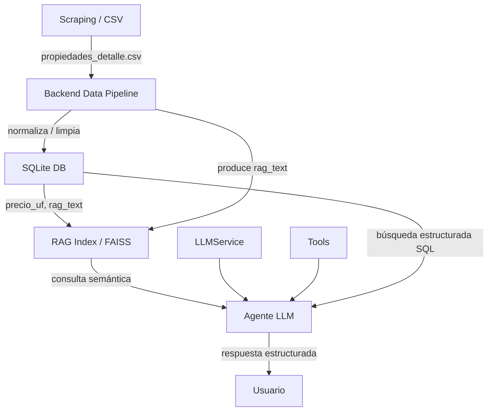

# Arquitectura del Agente Inmobiliario

## Componentes

- `scraping/`: extracción de datos crudos.
- `backend/data_pipeline.py`: normaliza valores, ubicaciones, amenities y construye texto RAG.
- `backend/db.py`: almacena y busca propiedades en SQLite, persiste UF y registra búsquedas.
- `app/rag_pipeline.py`: usa el pipeline de backend para indexar datos limpios en FAISS.
- `app/llm_service.py`: centraliza prompts de extracción de criterios y generación de respuestas.
- `app/main.py`: orquesta el flujo de consulta, búsqueda SQL/RAG y respuesta del agente.
